# Autism Spectrum Disorder (ASD) Classification
## Overview
This project explores **Autism Spectrum Disorder (ASD) classification from caregiver-written behavioral text**. The goal is to evaluate how effectively different machine learning paradigms—**classical ML vs deep learning**—can detect ASD-related signals from short natural-language descriptions of toddler behavior.

---

## Methods & Results
### [TASD Dataset](https://www.kaggle.com/datasets/sharafatahmed/tasd-dataset-text-based-early-asd-detection)
* Input data consist of free-text responses paired with a binary ASD label.
* Only two columns are used for modeling:
  * **Text**: Raw natural language input
  * **ASD**: Binary class label (ASD / Non-ASD)
* The dataset is **class-balanced**, eliminating the need for resampling or class-weight correction.

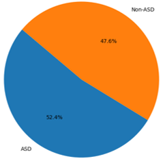

* Missing values are checked explicitly and none are present.
---

### Classical Machine Learning
This method implements a **text-based early Autism Spectrum Disorder (ASD) detection pipeline** using the TASD dataset. The focus is on building a classical NLP and machine learning model to setup a baseline before building a deep learning framework.  
This approach tests whether **lexical presence alone** is sufficient for classification and prioritizes interpretability.

#### Text Preprocessing
The text preprocessing pipeline is intentionally conservative to do minimal preprocessing:
* Lowercasing of text
* Tokenization using NLTK
* Stopword removal
* Punctuation and non-alphabetic filtering
* Stemming and lemmatization

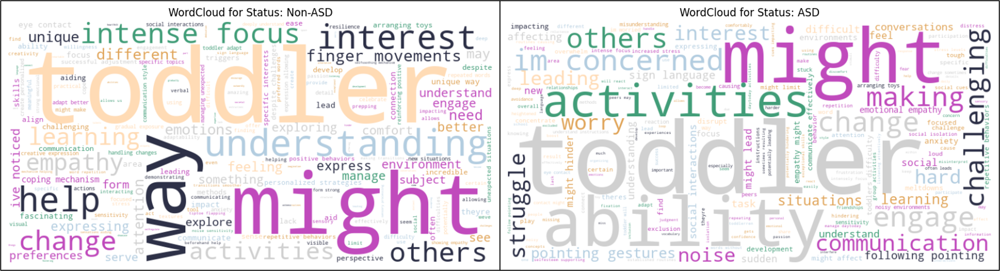

#### Feature Engineering
##### a. TF–IDF Vectorization

* Converts text into weighted term-frequency vectors
* Captures discriminative word usage patterns
* Works well for short, structured descriptions

##### b. Word-Level Statistical Features

* Token counts
* Vocabulary richness indicators
* Frequency-based signals

#### Model Selection
The modeling strategy prioritizes strong baselines with interpretability, the following models were tested:

* Bernoulli Naive Bayes
* Logistic Regression
* Decision Tree
* XGBoost

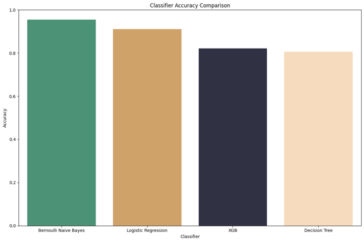 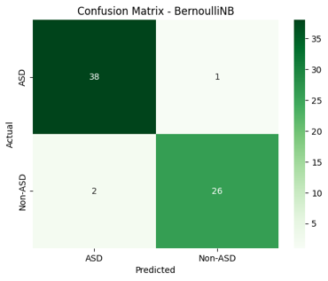

  
#### Model Interpretation
As Bernoulli Naive Bayes performed better then other we now try to interpret the performance. BernoulliNB models each feature as a binary event and learns the conditional probabilities
P(feature = 1 | class). To quantify feature influence, we computed log-odds ratios between classes: `log-odds(feature) = log P(feature | ASD) − log P(feature | non-ASD)`

Positive log-odds indicate features that push predictions toward the ASD class  
Negative log-odds indicate features favoring the non-ASD class  
Larger magnitudes correspond to stronger evidence

The most influential features are predominantly lexical and narrative patterns, including terms related to individuality, behavior, and explicit emotional or empathetic expression. This indicates that the model primarily captures linguistic markers commonly used in ASD-related descriptions. Numeric features (number of characters and sentences) showed near-zero contribution, confirming that predictions are driven by word presence rather than text length or structure.

---
### Deep Learning model
#### Text Preprocessing

Text preprocessing followed a conventional NLP pipeline:

* **Tokenization** was performed using a Keras `Tokenizer`, fitted only on the training corpus.
* Text sequences were converted to integer indices and **padded to a fixed maximum length** to ensure uniform input dimensions.
* Out-of-vocabulary tokens were handled implicitly via tokenizer constraints.

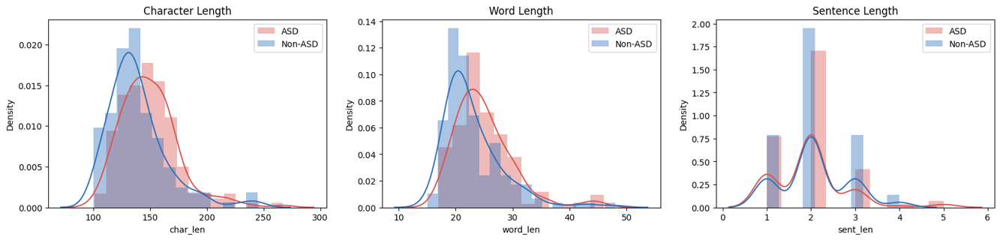    
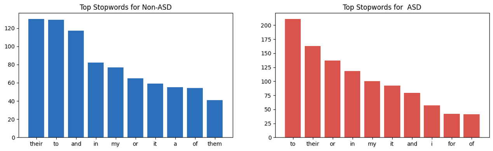   
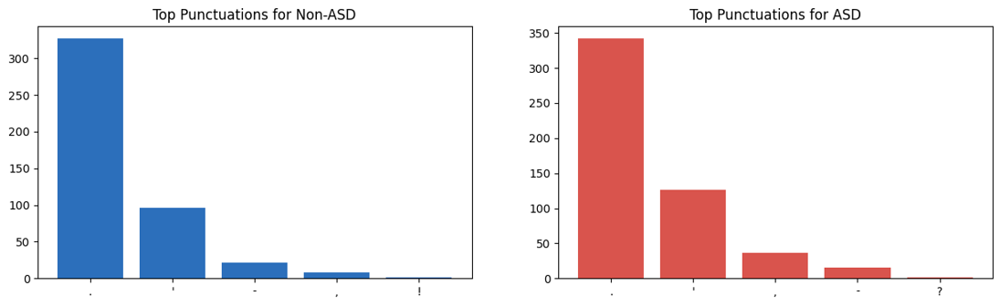    
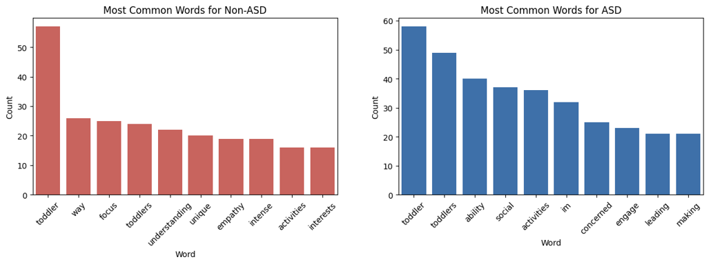  
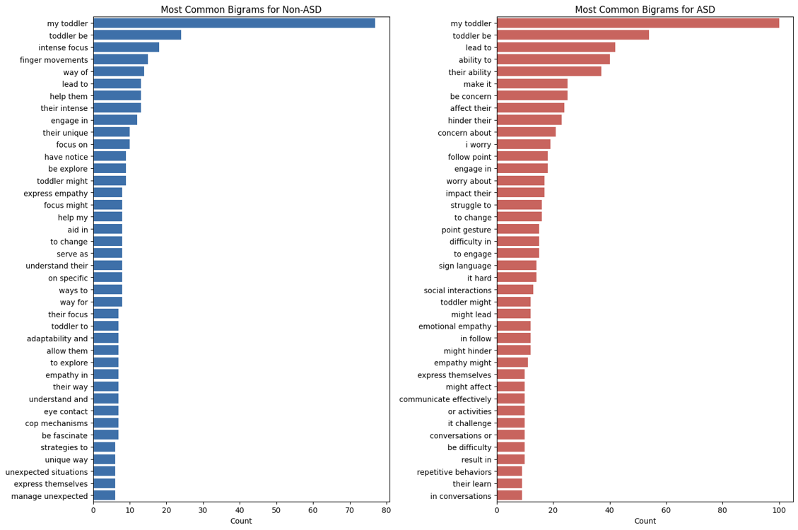    
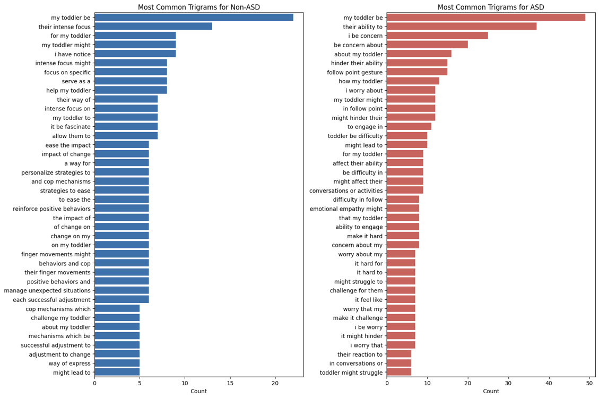  

    

Word cloud before quality control:
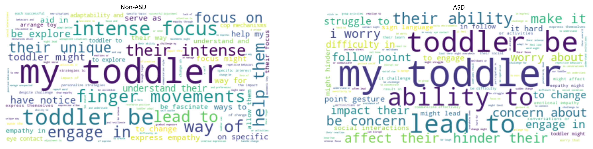    

  

Word cloud after quality control:
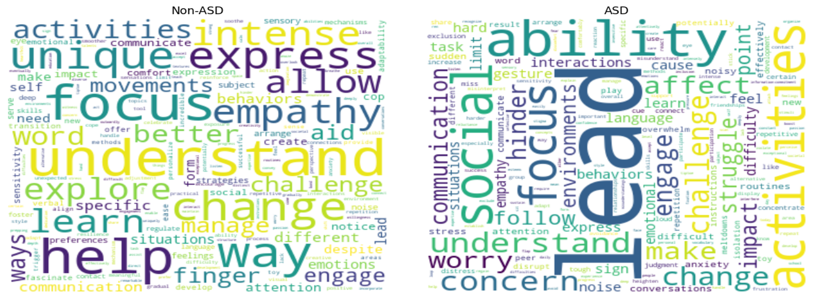    

#### Word Embeddings
We initialized word representations using **pretrained GloVe embeddings (200-dimensional)**:
* An embedding matrix was constructed by matching the training vocabulary against the GloVe corpus.
* The embedding layer was loaded with these weights, enabling the model to leverage semantic information learned from large external corpora. Words not found in GloVe were initialized with zeros.

#### Model Architecture
Two deep learning architectures were explored:

1. **LSTM Model**
   * Embedding layer initialized with GloVe weights
   * LSTM layer to capture sequential dependencies in text
   * Fully connected output layer with sigmoid activation for binary classification

2. **Bidirectional LSTM with Attention**
   * Bidirectional LSTM to capture both past and future context
   * Attention mechanism to learn token-level importance within each text sequence
   * Dense output layer for final classification  

The attention mechanism allows the model to focus on diagnostically informative phrases rather than treating all tokens equally.

#### Results

* The LSTM-based models successfully learned discriminative patterns from short behavioral text descriptions.

    

* Incorporating **Bidirectional LSTM and attention** improved the model’s ability to capture contextual and semantically salient information, leading to more stable validation performance compared to a unidirectional LSTM.

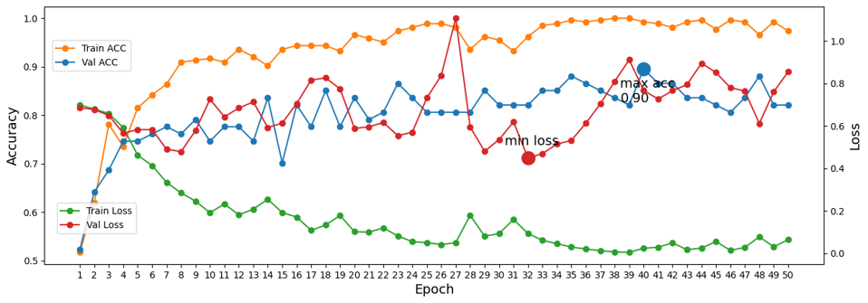    

## Conclusion
* **Bernoulli Naive Bayes model slightly outperformed LSTM and BiLSTM models** on this dataset.
* This indicates that ASD-related signals in caregiver text are largely **presence-based and lexical**, rather than dependent on sentence structure or word order.
* The result highlights the importance of **choosing models aligned with the data**, not defaulting to complex architectures.

